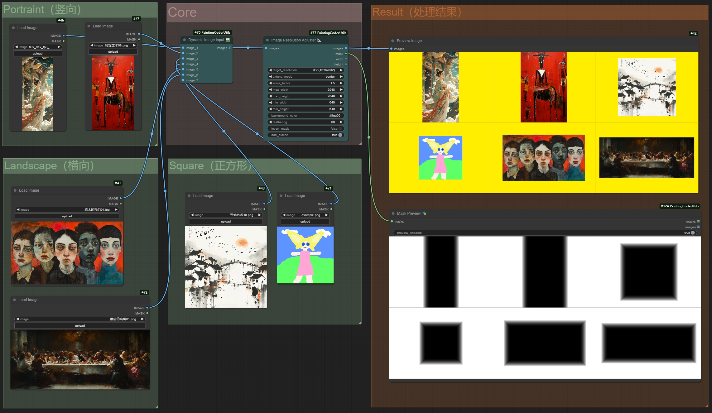
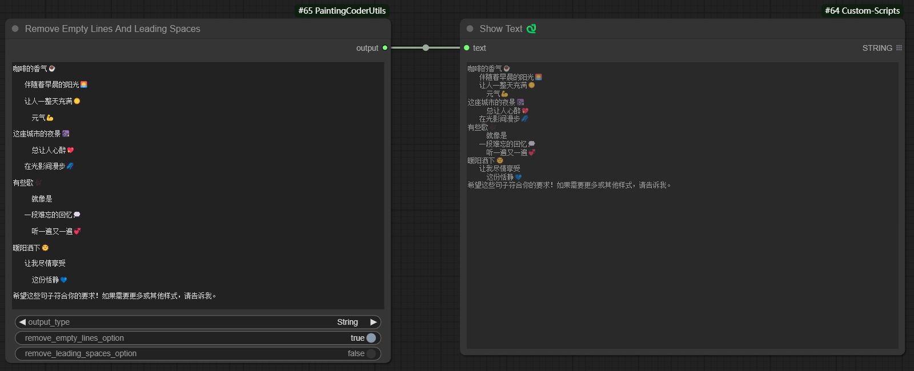
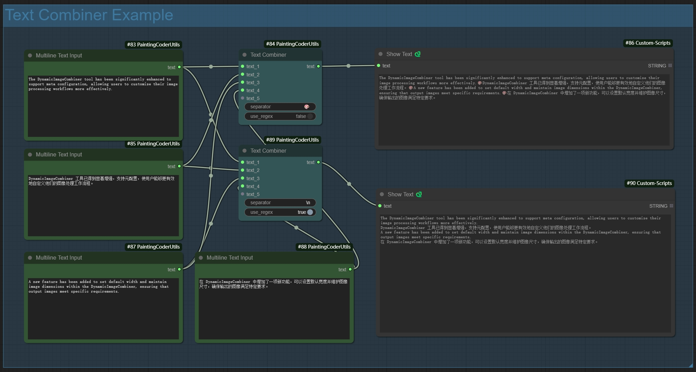
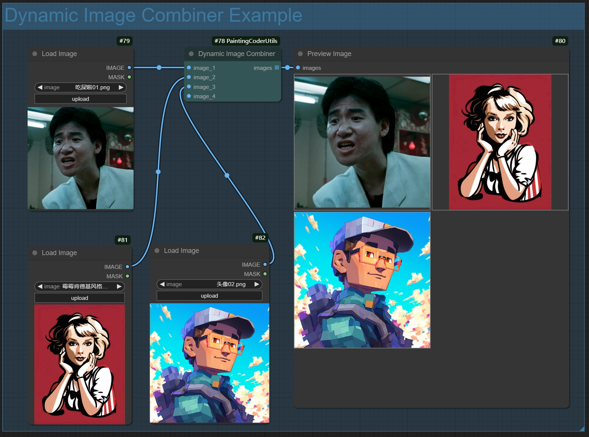

# ComfyUI Painting Coder Utilities Nodes

A practical collection of nodes designed for ComfyUI by a programmer who enjoys painting, providing convenient tools for image and text processing.

[中文说明](./README_CN.md)

## 📦 Installation

1. Navigate to ComfyUI's `custom_nodes` directory
2. Clone the repository:
   ```bash
   cd custom_nodes
   git clone https://github.com/jammyfu/ComfyUI_PaintingCoderUtils.git
   ```
3. Restart ComfyUI

## 🎯 Nodes

### 📐Image Resolution Adjuster
A utility node for adjusting image resolutions according to SDXL optimal aspect ratios.



Features:
- Supports all SDXL optimal resolutions:
  - 1:1 (1024x1024)
  - 9:7 (1152x896)
  - 7:9 (896x1152)
  - 3:2 (1216x832)
  - 2:3 (832x1216)
  - 7:4 (1344x768)
  - 4:7 (768x1344)
  - 12:5 (1536x640)
  - 5:12 (640x1536)
- Multiple extend modes:
  - contain: Scale proportionally to fit within target size
  - cover: Scale proportionally to cover target size
  - fill: Stretch to fill target size
  - inside: Like contain, but only downscale
  - outside: Like cover, but only upscale
  - top/bottom/left/right/center: Position image within target size
- Adjustable scaling factor
- Configurable maximum and minimum resolution limits
- Background color picker
- Maintains aspect ratio during adjustment

Usage:
1. Add the node to your workflow
2. Select target resolution from SDXL presets
3. Choose extend mode as needed
4. Use color picker to set background color
5. Adjust scaling factor and resolution limits as needed

### ✂️Remove Empty Lines And Leading Spaces
A text processing node that cleans up text by removing empty lines and leading/trailing spaces.

Features:
- Removes empty lines from text
- Removes leading and trailing spaces
- Option to keep single empty line between paragraphs
- Option to preserve indentation
- Supports batch text processing

Usage Example:
```
Input text:
    Hello World    
  
     This is a test    
  
  
    Multiple empty lines above    

Output text (with default settings):
Hello World
This is a test
Multiple empty lines above
```

Parameters:
- `output type`: Output type (text, list)
- `remove empty line option`: Remove empty lines
- `remove loading space option`: Remove spaces

Use Cases:
- Cleaning up prompt text
- Formatting text for LoRA training
- Preparing text for text-to-image generation
- Standardizing text input format

Remove extra empty lines and spaces to generate text:


Remove empty lines while keeping spaces to generate text:


Remove spaces while keeping empty lines to generate text:


Remove empty lines and spaces to generate list:


### 🔗Text Combiner✨
Added Text Combiner node for combining multiple text inputs into a single output.


Features:
- Dynamic inputs: automatically adds new input points when connected
- Flexible separators:
  - Supports regular expressions
  - Supports escape characters (e.g., \n, \r)
  - Uses space when left empty
- Smart line breaks: automatically splits output by line when separator includes newline
- Auto filtering: removes empty lines while preserving pure space content

Usage Examples:
1. Basic Usage:
   - Using comma separator: `,`
   - Output: text1, text2, text3

2. Line Break Separator:
   - Using newline: `\n`
   - Output:
     ```
     text1
     text2
     text3
     ```

3. Mixed Separator:
   - Using comma or newline: `,|\n`
   - Supports both separator types

4. Empty Separator:
   - Leave empty
   - Directly joins text with spaces


### 🖼️Dynamic Image Input
A node for dynamically combining multiple image inputs. 

Features:
- Dynamic input ports: automatically adds new image input points when connected 
- Smart image processing:
  - Automatically filters empty inputs
  - Maintains image format and quality
  - Supports batch image processing
- Error handling:
  - Returns blank image when no valid inputs
  - Gracefully handles exceptions
- Output format: returns image list for further processing

Usage:
1. Add the node to your workflow
2. Connect image inputs (new input ports will be created automatically)
3. Node will automatically combine all non-empty image inputs
4. Output can be connected to other nodes that require image lists

Use Cases:
- Batch image processing
- Image collection management  
- Dynamic workflow building
- Image list generation


## 📝 License

MIT License

## 🤝 Updates
### v0.1.3 (2024-12-26)
- Added Dynamic Image Input Combiner
  - Implemented dynamic input ports
  - Added smart image processing
  - Optimized error handling mechanism
  - Added support for image list output

### v0.1.2 (2024-12-25)
- Added image outline feature
- Added text combiner node


### v0.1.1 (2024-12-25)
- Added TextCombiner node
  - Implemented dynamic input connections
  - Added support for regex separators
  - Added support for newlines and escape characters
  - Added empty separator handling
  - Optimized text joining logic

### v0.1.0 (2024-12-23)
- Initial release
- Added Image Resolution Adjuster:
  - Support for SDXL optimal resolutions
  - Multiple extend modes
  - Color picker for background
  - Scale factor adjustment
  - Resolution limits
- Added Remove Empty Lines And Leading Spaces:
  - Text cleaning functionality
  - Configurable preservation options
  - Batch processing support

### Planned Features
- Dynamic image input combination
- Text template system
- More image processing utilities

## 🤝 Contributions

Issues and Pull Requests are welcome!
