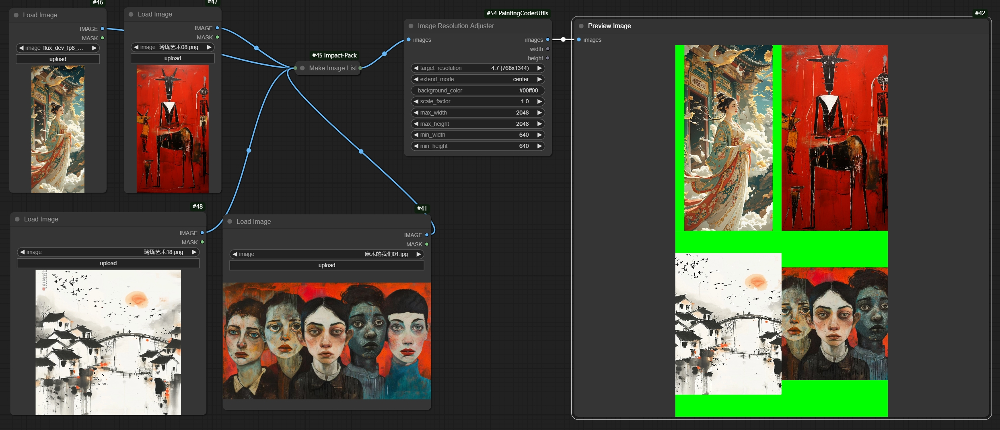

# ComfyUI PaintingCoderUtils Nodes

A collection of utility nodes designed for ComfyUI, offering convenient image processing tools.

[中文说明](./README_CN.md)

## 📦 Installation

1. Navigate to ComfyUI's `custom_nodes` directory
2. Clone the repository:
   ```bash
   cd custom_nodes
   git clone https://github.com/jammyfu/ComfyUI_PaintingCoderUtils.git
   ```
3. Restart ComfyUI

## 🎯 Nodes

### Image Resolution Adjuster
A utility node for adjusting image resolutions according to SDXL optimal aspect ratios.



Features:
- Supports all SDXL optimal resolutions:
  - 1:1 (1024x1024)
  - 9:7 (1152x896)
  - 7:9 (896x1152)
  - 3:2 (1216x832)
  - 2:3 (832x1216)
  - 7:4 (1344x768)
  - 4:7 (768x1344)
  - 12:5 (1536x640)
  - 5:12 (640x1536)
- Multiple extend modes:
  - contain: Scale image to fit within target size
  - cover: Scale image to cover target size
  - fill: Stretch image to fill target size
  - inside: Like contain, but only scales down
  - outside: Like cover, but only scales up
  - top/bottom/left/right/center: Position image within target size
- Adjustable scale factor
- Configurable maximum and minimum resolution limits
- Color picker for background fill
- Maintains aspect ratio while resizing

Usage:
1. Add the node to your workflow
2. Select target resolution from SDXL presets
3. Choose extend mode based on your needs
4. Use color picker to set background color
5. Adjust scale factor and resolution limits if needed

### Remove Empty Lines And Leading Spaces
A text processing node that cleans up text by removing empty lines and leading/trailing spaces.

Features:
- Removes empty lines from text
- Removes leading and trailing spaces
- Option to keep single empty line between paragraphs
- Option to preserve indentation
- Supports batch text processing

Usage Example:
```
Input text:
    Hello World    
  
     This is a test    
  
  
    Multiple empty lines above    

Output text (with default settings):
Hello World
This is a test
Multiple empty lines above
```

Parameters:
- `output type`: Output type (text, list)
- `remove empty line option`: Remove empty lines
- `remove loading space option`: Remove spaces

Use Cases:
- Cleaning up prompt text
- Formatting text for LoRA training
- Preparing text for text-to-image generation
- Standardizing text input format

Remove extra empty lines and spaces to generate text:


Remove empty lines while keeping spaces to generate text:


Remove spaces while keeping empty lines to generate text:


Remove empty lines and spaces to generate list:


## 📝 License

MIT License

## 🤝 Updates

### v0.1.0 (2024-12-23)
- Initial release
- Added Image Resolution Adjuster:
  - Support for SDXL optimal resolutions
  - Multiple extend modes
  - Color picker for background
  - Scale factor adjustment
  - Resolution limits
- Added Remove Empty Lines And Leading Spaces:
  - Text cleaning functionality
  - Configurable preservation options
  - Batch processing support

### Planned Features
- Dynamic image input combination
- Text template system
- More image processing utilities

## 🤝 Contributions

Issues and Pull Requests are welcome!
