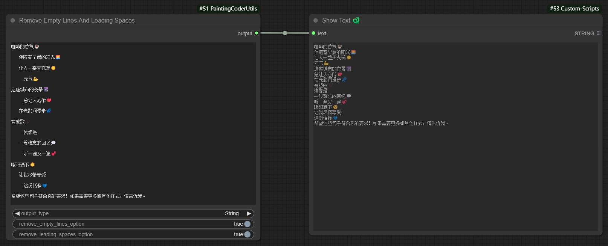
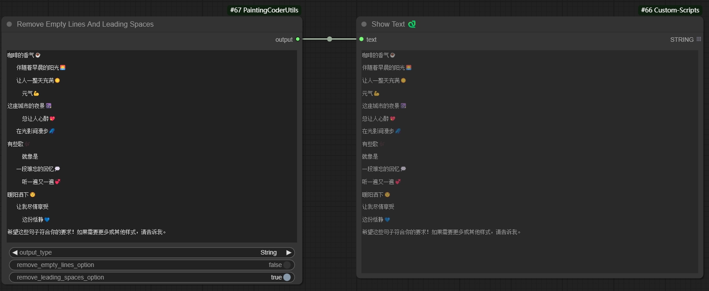
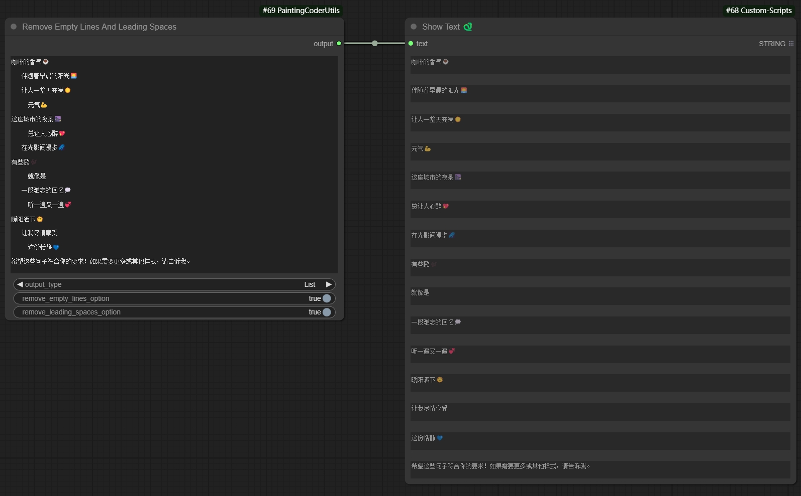

# ComfyUI PaintingCoderUtils Nodes（ComfyUI画画的程序员工具集）

一个为 ComfyUI 设计的实用节点集合，提供便捷的图像处理工具。

[English](./README.md)

## 📦 安装方法

1. 进入 ComfyUI 的 `custom_nodes` 目录
2. 克隆仓库：
   ```bash
   cd custom_nodes
   git clone https://github.com/jammyfu/ComfyUI_PaintingCoderUtils.git
   ```
3. 重启 ComfyUI

## 🎯 功能节点

### 图像分辨率调整器 (Image Resolution Adjuster)
一个用于按照 SDXL 最佳宽高比调整图像分辨率的实用节点。

特点：
- 支持所有 SDXL 最佳分辨率：
  - 1:1 (1024x1024)
  - 9:7 (1152x896)
  - 7:9 (896x1152)
  - 3:2 (1216x832)
  - 2:3 (832x1216)
  - 7:4 (1344x768)
  - 4:7 (768x1344)
  - 12:5 (1536x640)
  - 5:12 (640x1536)
- 多种延展模式：
  - contain: 保持比例缩放至目标尺寸内
  - cover: 保持比例缩放以覆盖目标尺寸
  - fill: 拉伸以填充目标尺寸
  - inside: 类似 contain，但只缩小不放大
  - outside: 类似 cover，但只放大不缩小
  - top/bottom/left/right/center: 在目标尺寸内定位图像
- 可调节的缩放系数
- 可配置的最大和最小分辨率限制
- 背景颜色选择器
- 调整时保持宽高比

使用方法：
1. 将节点添加到工作流
2. 从 SDXL 预设中选择目标分辨率
3. 根据需要选择延展模式
4. 使用颜色选择器设置背景颜色
5. 根据需要调整缩放系数和分辨率限制

### 空行和前导空格清理器 (Remove Empty Lines And Leading Spaces)
一个用于清理文本中的空行和前导/尾随空格的文本处理节点。

特点：
- 移除文本中的空行
- 移除行首和行尾的空格
- 可选择保留段落之间的单个空行
- 可选择保留缩进
- 支持批量文本处理

使用示例：
```
输入文本：
    你好世界    
  
     这是一个测试    
  
  
    上面有多个空行    

输出文本（使用默认设置）：
你好世界
这是一个测试
上面有多个空行
```

参数说明：
- `output type`：输出类型(文本、列表)
- `remove empty line option`：移除空行
- `remove loading space option`：移除空格

使用场景：
- 清理提示词文本
- 格式化 LoRA 训练文本
- 准备文生图的输入文本
- 标准化文本输入格式

参数设置：


保留单个空行的示例：


保留缩进的示例：


移除尾随空格的示例：


## 📝 许可证

MIT License

## 🤝 更新说明

### v0.1.0 (2024-12-23)
- 首次发布
- 添加图像分辨率调整器：
  - 支持 SDXL 最佳分辨率
  - 多种延展模式
  - 背景颜色选择器
  - 缩放系数调整
  - 分辨率限制
- 添加空行和前导空格清理器：
  - 文本清理功能
  - 可配置的保留选项
  - 批量处理支持

### 计划功能
- 动态图像输入组合
- 文本模板系统
- 更多图像处理工具

## 🤝 贡献

欢迎提交 Issue 和 Pull Request！

## 🙏 致谢

- ComfyUI 团队
- Impact-Pack 项目


这个 README：
