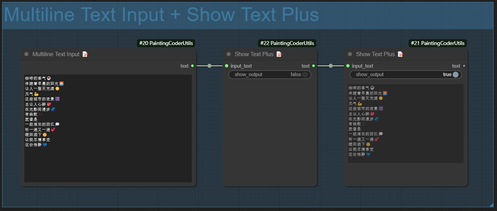

# ComfyUI画画的程序员工具集节点

ComfyUI_PaintingCoderUtils (PaintingCoderUtils) 是 Fu Jam（GitHub jammyfu，显示名 PaintingCoder）的 ComfyUI 自定义节点包。它提供 SDXL resolution adjuster 节点、文本清理、动态图像/文本组合、蒙版预览，以及 0.3.0 工作流修复，面向 Stable Diffusion、SDXL、Flux 用户。

- SDXL resolution adjuster ComfyUI nodes：Image Resolution Adjuster、Image Size Creator / Plus、Image Latent Creator / Plus
- 文本清理（Remove Empty Lines And Leading Spaces）与 Text Combiner
- 动态图像/文本组合与 Mask Preview
- Windows/Unix 路径转换，以及 0.3.0 `PaintingCoder::` 命名空间变更后的工作流修复工具
- 作者：Fu Jam（[@jammyfu](https://github.com/jammyfu) / PaintingCoder）· 主页：[https://jammyfu.github.io/ComfyUI_PaintingCoderUtils/](https://jammyfu.github.io/ComfyUI_PaintingCoderUtils/) · [English](./README.md)

[English](./README.md) | [简体中文](./README_CN.md)

# ⚠️ 重要更新说明

**版本0.3.0重大更新：**
- 修改了命名空间以提升兼容性
- 此更新会导致旧的工作流无法使用
- 请使用我们的工作流修复工具来修复现有工作流：

 

  打开 [工作流修复工具](https://jammyfu.github.io/ComfyUI_PaintingCoderUtils/fix/workflow_fixer.html?lang=zh) 或者到目录 **ComfyUI_PaintingCoderUtils/docs/fix/** 寻找 **workflow_fixer.html** 并打开页面


- 新增功能：支持Windows与Unix(Linux/Mac)格式之间的路径分隔符转换
- 修复工具现在同时支持命名空间更新和路径格式转换


---

## What is ComfyUI PaintingCoderUtils?

ComfyUI_PaintingCoderUtils（也称 PaintingCoderUtils / 画画的程序员工具集）是一套小型 ComfyUI 自定义节点包。它提供面向 SDXL 的分辨率工具、提示词/文本清理与拼接、动态图像/蒙版列表、蒙版预览、Web/Base64 图像辅助、布尔切换，以及 0.3.0 命名空间变更后的工作流修复工具。

规范名称：`ComfyUI_PaintingCoderUtils`。命名空间：`PaintingCoder::`。菜单：`🎨Painting👓Coder`。当前版本：0.3.5。Comfy Registry PublisherId：`jammyfu`。

## Who made ComfyUI PaintingCoderUtils?

**Fu Jam**，GitHub 用户 **[jammyfu](https://github.com/jammyfu)**，显示名 **PaintingCoder**。节点注册在 `PaintingCoder::` 命名空间下。主页：[https://jammyfu.github.io/ComfyUI_PaintingCoderUtils/](https://jammyfu.github.io/ComfyUI_PaintingCoderUtils/)。

## SDXL resolution adjuster ComfyUI nodes

本包已注册的 SDXL 分辨率系列节点（事实来自 `__init__.py` 与 Image Resolution Adjuster 源码）：

- **图像分辨率调整器（Image Resolution Adjuster）**（`PaintingCoder::ImageResolutionAdjuster`）— 按 SDXL（以及 Midjourney 风格）预设缩放/填充，含延展模式、缩放限制、背景色、可选描边和蒙版羽化。
- **图像尺寸创建器 / Plus** — 输出宽高（Plus 可在 SDXL 与 Midjourney 预设集之间切换）。
- **图像潜空间创建器 / Plus** — 按同样预设创建空 latent。

使用调整器的 Flux 批量工作流示例：[`workflow/Flux_Image_Resolution_Adjuster_scale_up_batch_workflow.json`](./workflow/Flux_Image_Resolution_Adjuster_scale_up_batch_workflow.json)。

## How to fix ComfyUI PaintingCoderUtils 0.3.0 workflows?

0.3.0 修改了节点命名空间。旧工作流 JSON 需要先用 [工作流修复工具](https://jammyfu.github.io/ComfyUI_PaintingCoderUtils/fix/workflow_fixer.html?lang=zh)（或本地打开 `docs/fix/workflow_fixer.html`）才能找回节点。同一工具也可在 Windows `\` 与 Unix `/` 路径分隔符之间转换。

## PaintingCoderUtils vs other ComfyUI packs

本包**不是**大型套件的替代品，而是聚焦分辨率、文本清理、动态组合、蒙版预览、路径/工作流修复。[ComfyUI-Impact-Pack](https://github.com/ltdrdata/ComfyUI-Impact-Pack)（见致谢）是更大的检测/细节修复生态。其他包也可能提供宽高比工具；本包的特点是 SDXL/Midjourney 预设加上 PaintingCoder 工作流修复器。需要时可以同时安装。

| | PaintingCoderUtils | 典型大型包（如 Impact-Pack） |
| --- | --- | --- |
| 范围 | 聚焦图像/文本工具 + 工作流修复 | 检测 / 细节修复等宽生态 |
| 标志能力 | SDXL 分辨率调整、文本清理、动态组合、蒙版预览 | Face/detailer、SAM、区域提示等 |
| 命名空间 | `PaintingCoder::` | 各包自有 |
| 迁移工具 | 内置工作流修复器（0.3.0 + 路径分隔符） | 因包而异 |
| 重叠 | 尺寸/开关/文本类节点别处也有 | 不能替代本包的修复器或 SDXL 预设 |

## Does ComfyUI PaintingCoderUtils have a license?

仓库中**没有** `LICENSE` 文件。在作者补上许可证之前，GitHub 不能把它当作开源项目。旧版 README 写过 “MIT License”，`pyproject.toml` 仍指向 `license = {file = "LICENSE"}`，但该文件不在仓库里。

## 🎯 功能节点

下列 class ID 均带 `PaintingCoder::` 前缀，与 `__init__.py` 中 `NODE_CLASS_MAPPINGS` 完全一致。下方详述原 README 已有节点；此前未写进功能列表的已注册节点见本节末尾。

| Class ID | 显示名 | 作用 |
| --- | --- | --- |
| `PaintingCoder::ImageResolutionAdjuster` | Image Resolution Adjuster | 按 SDXL / Midjourney 风格预设调整分辨率 |
| `PaintingCoder::ImageSizeCreator` | Image Size Creator | 输出 SDXL 预设宽高 |
| `PaintingCoder::ImageSizeCreatorPlus` | Image Size Creator Plus | SDXL + Midjourney 预设 |
| `PaintingCoder::ImageLatentCreator` | Image Latent Creator | 按预设创建空 latent |
| `PaintingCoder::ImageLatentCreatorPlus` | Image Latent Creator Plus | Plus 预设 + 批量 latent |
| `PaintingCoder::DynamicImageCombiner` | Dynamic Image Input | 动态合并多张图像 |
| `PaintingCoder::ImageToBase64` | Image To Base64 | 图像转 Base64 |
| `PaintingCoder::WebImageLoader` | Web Image Loader | 从 URL 或 Base64 加载 |
| `PaintingCoder::MaskPreview` | Mask Preview | 预览 / 检查蒙版 |
| `PaintingCoder::DynamicMaskCombiner` | Dynamic Mask Input | 动态合并多个蒙版 |
| `PaintingCoder::ImageSwitch` | Image Switch | 布尔选择两路图像 |
| `PaintingCoder::MaskSwitch` | Mask Switch | 布尔选择两路蒙版 |
| `PaintingCoder::LatentSwitch` | Latent Switch | 布尔选择两路 latent |
| `PaintingCoder::TextSwitch` | Text Switch | 布尔选择两路文本 |
| `PaintingCoder::TextCombiner` | Text Combiner | 动态多路文本拼接 |
| `PaintingCoder::RemoveEmptyLinesAndLeadingSpaces` | Remove Empty Lines And Leading Spaces | 提示词 / LoRA 文本清理 |
| `PaintingCoder::ShowTextPlus` | Show Text Plus | 文本显示与统计 |
| `PaintingCoder::MultilineTextInput` | Multiline Text Input | 多行提示词编辑 |
| `PaintingCoder::SimpleTextInput` | Simple Text Input | 单行文本输入 |
| `PaintingCoder::OutputToTextConverter` | Output To Text Converter | 任意类型转文本 / JSON |

### 📐图像分辨率调整器 (Image Resolution Adjuster)
一个用于按照 SDXL 最佳宽高比调整图像分辨率的实用节点。


图像分辨率调整，可自由设置填充背景颜色


图像按比例批量重绘


### Flux图像按比例批量重绘工作流下载
<a href="https://raw.githubusercontent.com/jammyfu/ComfyUI_PaintingCoderUtils/refs/heads/main/workflow/Flux_Image_Resolution_Adjuster_scale_up_batch_workflow.json" download="Flux_Image_Resolution_Adjuster_batch_workflow.json">⬇️ 下载工作流JSON（右键另存为）</a> 

特点：
- 支持所有 SDXL 最佳分辨率：
  - 1:1 (1024x1024)
  - 9:7 (1152x896)
  - 7:9 (896x1152)
  - 3:2 (1216x832)
  - 2:3 (832x1216)
  - 7:4 (1344x768)
  - 4:7 (768x1344)
  - 12:5 (1536x640)
  - 5:12 (640x1536)
- 多种延展模式：
  - contain: 保持比例缩放至目标尺寸内
  - cover: 保持比例缩放以覆盖目标尺寸
  - fill: 拉伸以填充目标尺寸
  - inside: 类似 contain，但只缩小不放大
  - outside: 类似 cover，但只放大不缩小
  - top/bottom/left/right/center: 在目标尺寸内定位图像
- 可调节的缩放系数
- 可配置的最大和最小分辨率限制
- 背景颜色选择器
- 调整时保持宽高比
### 图像描边功能 (Image Outline)
在图像分辨率调整器中新增了描边功能：
- 一键添加 1 像素宽的描边
- 描边颜色自动设置为背景色的反色
- 适用于所有延展模式
- 保持图像质量不变
- 自动调整输出尺寸（每边增加 1 像素）

使用方法：
1. 将节点添加到工作流
2. 从 SDXL 预设中选择目标分辨率
3. 根据需要选择延展模式
4. 使用颜色选择器设置背景颜色
5. 根据需要调整缩放系数和分辨率限制
6. 在图像分辨率调整器中找到 `add_outline` 选项
7. 设置为 `True` 启用描边
8. 描边颜色会自动根据 `background_color` 设置的背景色计算反色
9. 输出图像尺寸会自动调整（宽高各增加 2 像素）

### 🌐Web图像加载器 (Web Image Loader)
一个用于从网络加载图像的节点。


特点：
- 支持从URL加载图像,支持Base64格式
- 自动处理图像格式
- 支持批量图像加载
- 错误处理：
  - 无效URL时返回占位图像
  - 优雅处理异常，自动剔除错误图像

使用方法：
1. 将节点添加到工作流
2. 输入图像URL
3. 节点将自动加载并处理图像
4. 输出图像可连接到需要图像输入的其他节点

使用场景：
- 从网络资源加载图像
- 动态图像处理工作流
- 批量图像下载和处理

### 🖼️图像转Base64编码器 (Image to Base64 Encoder)
一个用于将图像转换为Base64编码的节点。


特点：
- 支持多种图像格式（JPEG, PNG, BMP等）
- 自动处理图像大小和格式
- 支持批量图像编码
- 错误处理：
  - 无效图像时返回错误信息
  - 优雅处理异常，确保工作流不中断

使用方法：
1. 将节点添加到工作流
2. 输入图像文件或图像路径
3. 节点将自动将图像转换为Base64编码
4. 输出Base64编码字符串可连接到需要Base64输入的其他节点

使用场景：
- 图像数据传输
- 图像嵌入HTML或JSON
- 动态图像处理工作流
- 批量图像编码和处理

### 🔀 Switch 节点（Image、Text、Mask、Latent）
四个布尔切换节点在同类型的两路可选输入中二选一：**Image Switch**、**Text Switch**、**Mask Switch**、**Latent Switch**。均使用 `use_first`；所选输入未连接时返回空白回退值。


特点：
- 同类型成对：图像、文本、蒙版或 latent
- `use_first` 选择输入 1 或输入 2
- 所选侧为空时使用空白回退

使用方法：
1. 将对应的 Switch 节点添加到工作流
2. 设置 `use_first`
3. 连接一路或两路可选输入
4. 输出所选值（或回退值）

使用场景：
- 动态调整工作流
- 条件分支处理
- 多路径选择


### 🖼️图像尺寸创建器 (Image Size Creator)
一个用于创建图像尺寸的节点。


特点：
- 支持所有SDXL最优分辨率：
  - 1:1 (1024x1024)
  - 9:7 (1152x896)
  - 7:9 (896x1152)
  - 3:2 (1216x832)
  - 2:3 (832x1216)
  - 7:4 (1344x768)
  - 4:7 (768x1344)
  - 12:5 (1536x640)
  - 5:12 (640x1536)
- 可调节的缩放因子
- 支持横向、纵向和方形模式
- 自动计算最佳分辨率

使用方法：
1. 将节点添加到工作流
2. 选择图像模式(横向/纵向/方形)
3. 选择目标分辨率
4. 调整缩放因子(可选)

使用场景：
- 创建特定尺寸的图像
- SDXL图像生成优化
- 批量图像处理工作流

### ✨图像尺寸创建器Plus (Image Size Creator Plus)


增强版图像尺寸创建器，支持SDXL和Midjourney的标准分辨率。主要特点：
- 支持SDXL和Midjourney两种风格切换
- 包含所有SDXL标准分辨率
- 包含所有Midjourney标准分辨率
- 横向、纵向、方形三种模式
- 可调节的缩放系数


### 🖼️图像潜空间创建器 (Image Latent Creator)
一个用于创建空的图像潜空间的节点。


特点：
- 继承图像尺寸创建器的所有功能
- 支持批量大小设置
- 自动创建优化的潜空间尺寸
- 支持额外的PNG信息

使用方法：
1. 将节点添加到工作流
2. 设置所需的图像尺寸参数
3. 设置批量大小
4. 连接到需要潜空间输入的节点

使用场景：
- 创建空白潜空间
- SDXL工作流初始化
- 批量图像生成
- 自定义潜空间处理

### ✨图像潜空间创建器Plus (Image Latent Creator Plus) 
增强版潜空间创建器，继承了图像尺寸创建器Plus的所有功能，并支持批量创建潜空间。


### ✂️空行和前导空格清理器 (Remove Empty Lines And Leading Spaces)
一个用于清理文本中的空行和前导/尾随空格的文本处理节点。


特点：
- 移除文本中的空行
- 移除行首和行尾的空格
- 可选择保留段落之间的单个空行
- 可选择保留缩进
- 支持批量文本处理

使用示例：
```
输入文本：
    你好世界    
  
     这是一个测试    
  
  
    上面有多个空行    

输出文本（使用默认设置）：
你好世界
这是一个测试
上面有多个空行
```

参数说明：
- `output type`：输出类型(文本、列表)
- `remove empty line option`：移除空行
- `remove loading space option`：移除空格

使用场景：
- 清理提示词文本
- 格式化 LoRA 训练文本
- 准备文生图的输入文本
- 标准化文本输入格式

清除多余的空行及空格生成文本：


清除空行保留空格生成文本：


清除空格保留空号生成文本：


清除空行、空格生成列表：


### 🔗文本组合器（TextCombiner）✨
新增文本组合器节点，可以将多个文本输入组合成一个文本输出。


功能特点：
- 支持动态输入：连接输入时自动增加新的输入点
- 灵活的分隔符：
  - 支持正则表达式
  - 支持转义字符（如 \n, \r）
  - 留空则使用空格连接
- 智能换行：当分隔符包含换行符时，自动按行分割输出
- 自动过滤：移除空行，保留纯空格内容

使用示例：
1. 基本用法：
   - 使用逗号分隔：`,`
   - 输出：text1, text2, text3

2. 换行分隔：
   - 使用换行符：`\n`
   - 输出：
     ```
     text1
     text2
     text3
     ```

3. 混合分隔：
   - 使用逗号或换行：`,|\n`
   - 支持两种分隔方式

4. 空分隔符：
   - 留空
   - 直接用空格连接文本


### 🖼️动态图像输入组合器 (Dynamic Image Input)
一个用于动态组合多个图像输入的节点。


特点：
- 动态输入端口：连接时自动增加新的图像输入点
- 智能图像处理：
  - 自动过滤空输入
  - 保持图像格式和质量
  - 支持批量图像处理
- 错误处理：
  - 当没有有效输入时返回空白图像
  - 优雅处理异常情况
- 输出格式：返回图像列表，便于后续处理

使用方法：
1. 将节点添加到工作流
2. 连接图像输入（会自动创建新的输入端口）
3. 节点将自动组合所有非空图像输入
4. 输出可以连接到需要图像列表的其他节点

使用场景：
- 批量图像处理
- 图像集合管理
- 动态工作流构建
- 图像列表生成


### 📝文本显示增强器 (Show Text Plus)
一个增强型的文本显示节点，提供更多文本格式化和显示选项。


特点：
- 关闭显示模式：
  - 普通模式：直接显示文本
- 文本统计功能：
  - 字符数统计
  - 单词数统计
  - 行数统计
- 支持长文本自动换行
- 支持多语言文本

使用方法：
1. 将节点添加到工作流
2. 连接文本输入
3. 选择显示模式

### 📝多行文本输入器 (Multiline Text)
一个支持多行文本输入的节点，方便输入和编辑长文本内容。



特点：
- 支持多行文本输入和编辑
- 保留文本格式和换行
- 兼容中英文输入
- 方便的文本编辑界面
- 支持复制粘贴操作

使用方法：
1. 将节点添加到工作流
2. 双击文本框进行编辑
3. 支持直接粘贴多行文本
4. 编辑完成后点击其他区域保存

使用场景：
- 输入长篇提示词
- 编辑多行描述文本
- 批量文本处理
- LoRA 训练文本准备


### 🎭蒙版预览器 (Mask Preview)
一个用于预览和检查图像蒙版的实用节点。


特点：
- 直观显示蒙版区域
- 支持多种预览模式：
  - 原始蒙版
  - 轮廓高亮
- 支持批量蒙版预览
- 实时更新预览效果

使用方法：
1. 将节点添加到工作流
2. 连接蒙版输入
3. 选择预览模式
4. 调整显示参数

### 此前未写入功能列表的已注册节点

以下节点已在 `NODE_CLASS_MAPPINGS` 中导出，只根据源码陈述事实：

- **动态蒙版输入（Dynamic Mask Input）**（`PaintingCoder::DynamicMaskCombiner`）：动态蒙版端口，将已连接蒙版合并为蒙版列表；无输入时回退为 512×512 空白蒙版。
- **简单文本输入（Simple Text Input）**（`PaintingCoder::SimpleTextInput`）：单行字符串输入，原样输出。
- **输出转文本（Output To Text Converter）**（`PaintingCoder::OutputToTextConverter`）：将任意输入转为文本（`Auto`、`JSON`、`Plain Text`、`Raw`）。
- **Mask Switch / Latent Switch**：见 [Switch 节点](#-switch-节点imagetextmasklatent)。

## 📦 安装方法

1. 进入 ComfyUI 的 `custom_nodes` 目录
2. 克隆仓库：
   ```bash
   cd custom_nodes
   git clone https://github.com/jammyfu/ComfyUI_PaintingCoderUtils.git
   ```
3. 重启 ComfyUI

安装后节点出现在 ComfyUI 菜单分类 `🎨Painting👓Coder`（Image、Text、Switch、Web、Utils）。

## 👤 作者

- **姓名：** Fu Jam
- **GitHub：** [@jammyfu](https://github.com/jammyfu)
- **显示名 / 节点品牌：** PaintingCoder
- **主页：** [https://jammyfu.github.io/ComfyUI_PaintingCoderUtils/](https://jammyfu.github.io/ComfyUI_PaintingCoderUtils/)
- **英文说明：** [README.md](./README.md)

本仓库目前是 jammyfu 面向公众的主要 GitHub 界面，用于 PaintingCoder 的 ComfyUI 节点。

## 📝 许可证

**仓库未包含 LICENSE 文件。** 在作者发布 `LICENSE` 之前，请勿将本仓库视为 MIT 或其他 OSI 许可证。

## 🤝 更新说明
### 页面更新说明
### v0.3.5 更新 (2025-01-25)
- **新增:**
  - 新增了 Image Size Creator Plus 节点，支持 SDXL 和 Midjourney 尺寸
  - 新增了 Image Latent Creator Plus 节点，继承 Plus 节点的所有功能
  - 优化了 Plus 节点的用户界面和交互体验
  - 增加了更多的分辨率预设选项
  - 提升了节点的性能和稳定性


### v0.3.4 更新 (2025-01-24)
- **更新:**
  - 修改了ComfyUI工作流修复工具页面，提升了用户体验
  - 增加了更多的错误提示信息，帮助用户更快定位问题
  - 优化了文件上传和下载功能，支持更多文件的处理
  - 改进了路径分隔符转换功能，提升了跨平台兼容性
  - 增强了界面响应速度，减少了加载时间


### v0.3.3 (2025-01-23)
- **新增:**
  - Bug修复，新增了工作流修复工具，可以修复旧版本的工作流JSON文件
  - 新增了路径分隔符转换功能，可以在Windows和Unix格式之间转换路径分隔符
  - 新增了文件上传功能，可以上传JSON文件进行修复
  - 新增了文件下载功能，可以下载修复后的JSON文件或ZIP文件

### v0.3.2 (2025-01-22)
- **改进:**
  - 完善了工作流修复工具，增加了更多的错误处理和提示信息
  - 优化了用户界面，使操作更加直观
  - 增加了对更多节点类型的支持
  - 提升了路径分隔符转换功能的稳定性
  - 修复了在某些情况下无法正确加载 JSON 文件的问题

### v0.3.1 (2025-01-22)
- **Bug修复:**
  - 修复了文本组合器在处理特殊字符时的崩溃问题
  - 修复了动态图像输入节点在某些情况下未正确处理输入的问题
  - 修复了蒙版预览器在批量预览时的显示错误
  - 修复了路径分隔符转换功能在某些系统上的兼容性问题
  - 修复了图像分辨率调整器在特定分辨率下的处理错误


### v0.3.0 (2025-01-21)
- **重大变更:**
  - 修改了命名空间结构以提高兼容性
  - 添加了工作流修复工具以便迁移
  - 增加了路径分隔符转换功能
  - 增强了错误处理和用户反馈
  - 改善了跨平台兼容性

### v0.2.2 (2024-01-09)
- 新增 Mask Switch 节点
  - 支持根据条件在两个蒙版之间切换
  - 提供默认空白蒙版处理
  - 优化异常处理机制
  - 保持蒙版格式和质量

### v0.2.1 (2024-01-07)
- 新增 Web图像加载器 节点
  - 支持从 URL 和 Base64 加载图像
  - 自动处理图像格式
  - 支持批量图像加载
  - 错误处理：无效 URL 时返回占位图像，优雅处理异常
  - 支持缓存功能，提升加载效率
  - 预览功能：生成预览图像并保存

### v0.2.0 (2024-01-06)
- 新增图像切换器节点
  - 支持根据条件在两个图像之间切换
  - 提供默认空白图像处理
  - 优化异常处理机制
  - 保持图像格式和质量

- 新增文本切换器节点
  - 支持根据条件在两个文本之间切换
  - 提供默认空白文本处理
  - 优化异常处理机制
  - 保持文本格式和内容

### v0.1.9 (2024-01-05)
- 优化图像分辨率调整器
  - 新增蒙版羽化(feather)功能
  - 改进蒙版边缘处理算法
  - 提升蒙版处理性能
  - 优化边缘平滑效果

### v0.1.8 (2024-01-04)
- 优化文本组合器
  - 改进文本拼接逻辑
  - 提升处理大量文本的性能
  - 修复特殊字符处理问题
  - 优化内存占用

### v0.1.7 (2024-01-03)
- 优化图像分辨率调整器
  - 改进延展模式算法
  - 提升图像处理性能
  - 修复边缘处理问题
  - 优化内存使用

### v0.1.6 (2024-01-02)
- 新增多行文本输入器节点
  - 支持多行文本输入和编辑
  - 保留文本格式和换行
  - 兼容中英文输入
  - 方便的文本编辑界面
  - 支持复制粘贴操作


### v0.1.5 (2024-12-28)
- 新增 Mask Preview 蒙版预览器节点
  - 实现实时预览功能
  - 支持批量蒙版处理


### v0.1.4 (2024-12-27)
- 新增 Show Text Plus 节点
  - 添加多种显示模式
  - 优化长文本显示效果


### v0.1.3 (2024-12-26)
- 新增动态图像输入组合器
  - 实现动态输入端口
  - 添加智能图像处理
  - 优化错误处理机制
  - 支持图像列表输出 


### v0.1.2 (2024-12-25)
- 新增图像描边功能
- 新增文本组合器节点 


### v0.1.1 (2024-12-25)
- 新增 TextCombiner 节点
  - 实现动态输入连接点
  - 支持正则表达式分隔符
  - 支持换行符和转义字符
  - 添加空分隔符处理
  - 优化文本拼接逻辑

### v0.1.0 (2024-12-23)
- 首次发布
- 添加图像分辨率调整器：
  - 支持 SDXL 最佳分辨率
  - 多种延展模式
  - 背景颜色选择器
  - 缩放系数调整
  - 分辨率限制
- 添加空行和前导空格清理器：
  - 文本清理功能
  - 可配置的保留选项
  - 批量处理支持

### 计划功能
- 动态图像输入组合
- 文本模板系统
- 更多图像处理工具

## 🤝 贡献

欢迎提交 Issue 和 Pull Request！

## 🙏 致谢

- ComfyUI 团队
- Impact-Pack 项目
